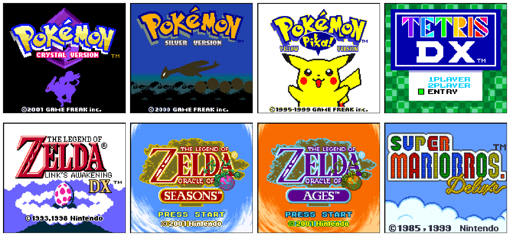
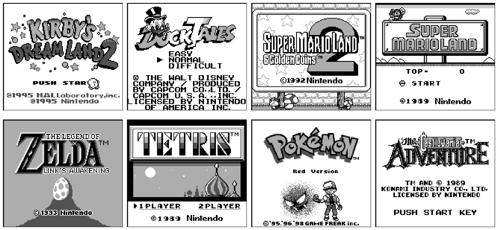
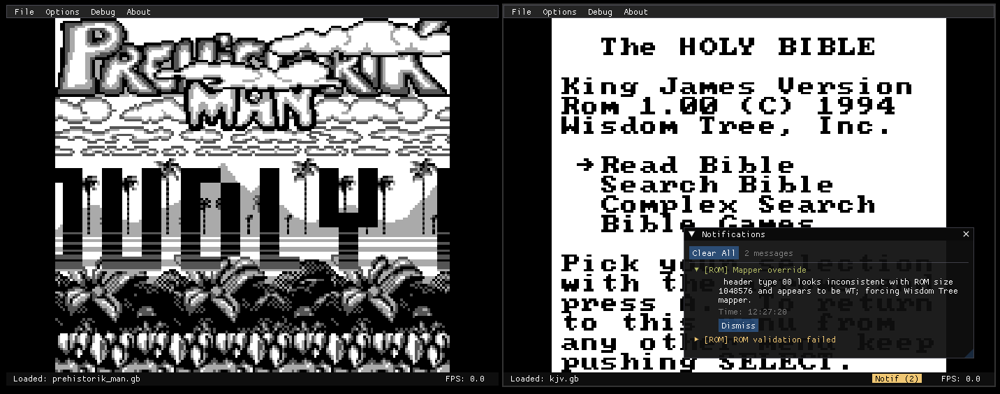
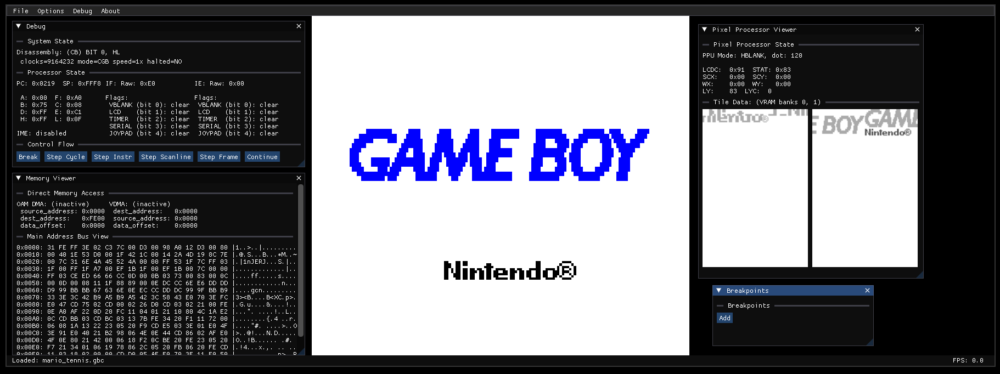
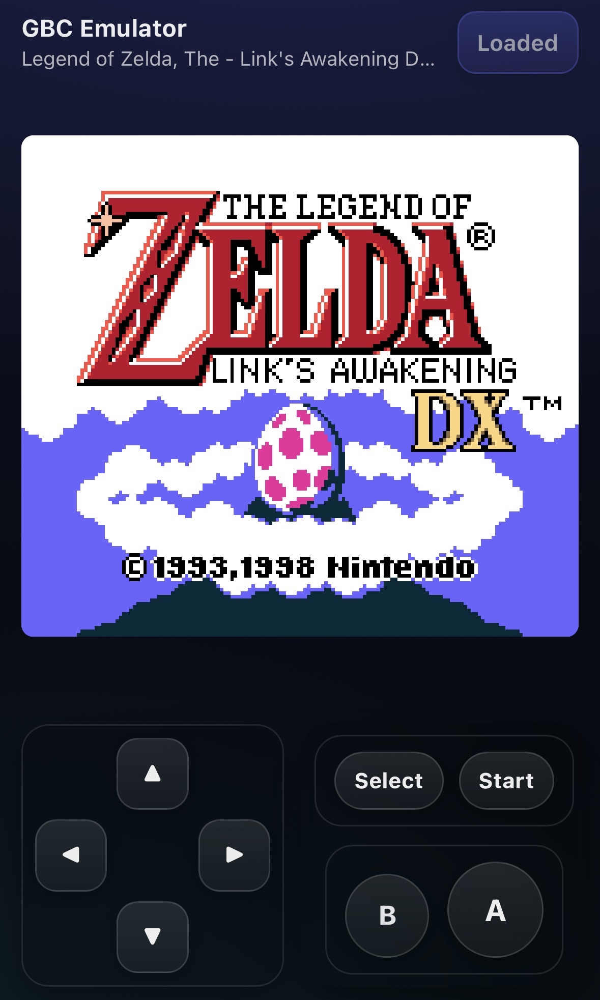
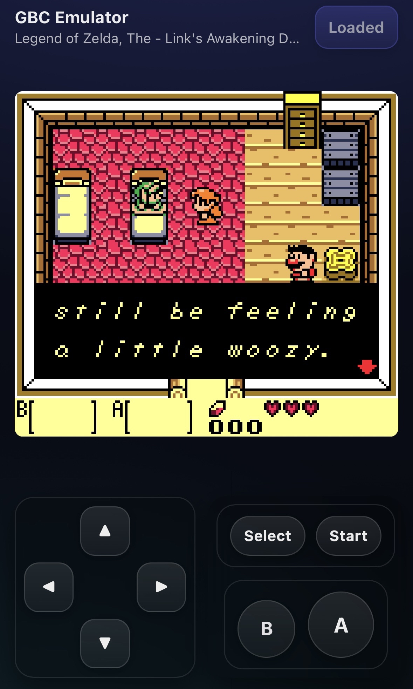
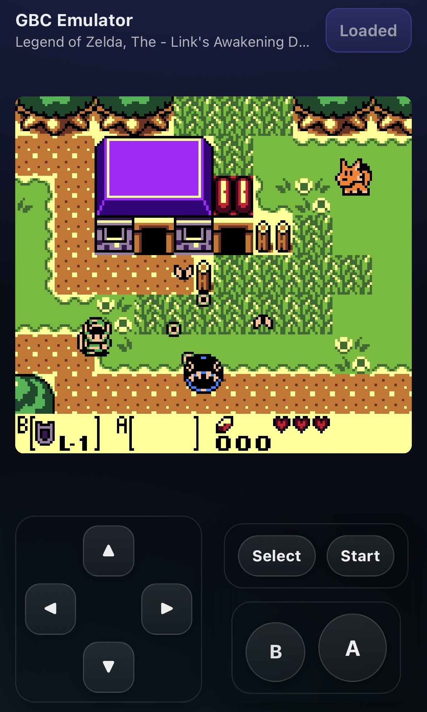
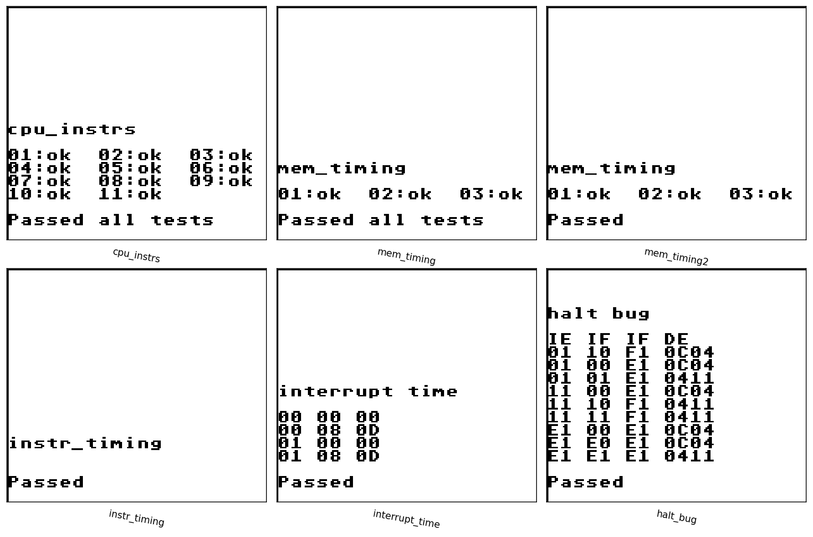
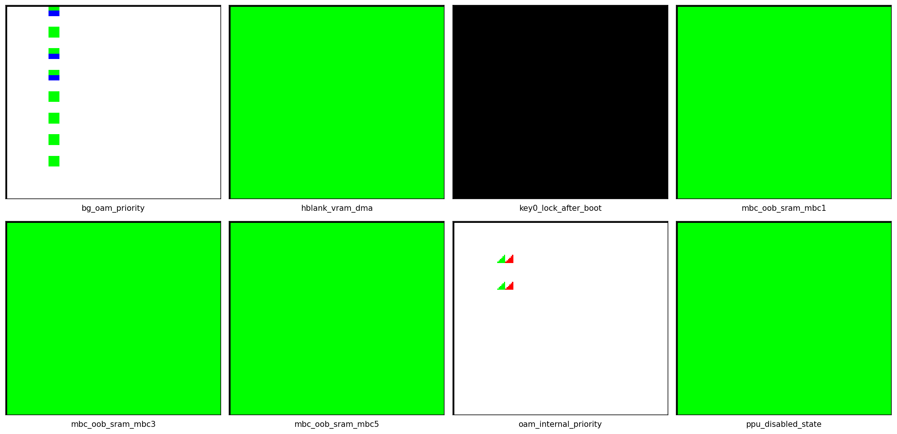
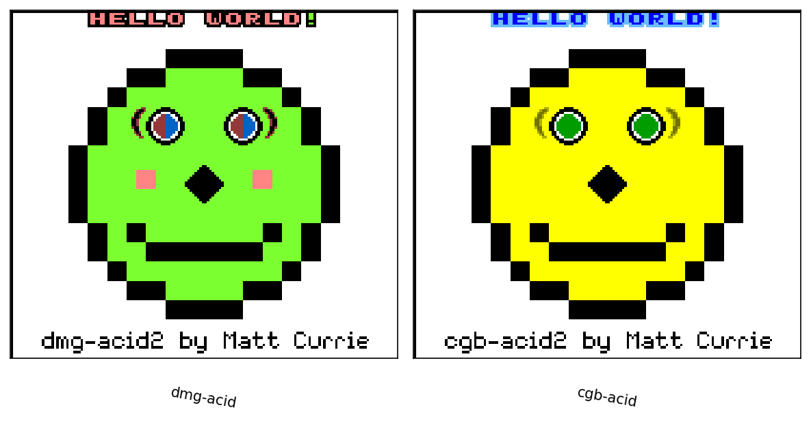

# Overview
Lolyep. Presenting IroGB, a Game Boy Color emulator written entirely from scratch. It serves as a spiritual successor to an earlier (and very poorly written) [DMG GameBoy Emulator](https://github.com/AlexSutila/GBEmulator), aiming to be a cleaner, more accurate, and more modular foundation for both DMG and CGB emulation.

This emulator is designed to be compatible with **Game Boy Color (CGB)** games, and also implements the backwards compatability features CGB models provide. As such, this emulator can be used to emulate **original DMG GameBoy** games as well. The games shown in the screenshot below do not define the compatability limitations of this emulator, but they are known to play reasonably well.

### CGB Model Compatability

 - Full support for RGB555 coloring CGB models use for visuals.

### DMG Model Backwards Compatability

 - Full support for authentic re-coloring of original monochrome games through a configurable BIOS.
 - That re-coloring of DMG games can be optionally disabled (since it looks hideous for some games).

## Features
The emulator core was written to be "behaviorally accurate" enough to enable support for games that are known to be difficult to emulate. We have our eyes set specifically on games that are technical and push the hardware to it's limits and also games that are rely on niche internal cartridge circuitry and as a result do not typically find wide support amongst other emulators. **Examples:**


### Desktop Version
There are two desktop versions, but the main version is built on [ImGUI](https://github.com/ocornut/imgui) and [SDL3](https://wiki.libsdl.org/SDL3/FrontPage) and offers what you would typically expect from a featureful emulator. It runs on the same emulator core described above and has a variety of built-in debugging tools:


### WebUI Version
The web version is built on [raylib](https://github.com/raysan5/raylib) and aims to offer more availability to those that don't want to compile from source. It uses the [emsdk](https://github.com/emscripten-core/emsdk) to compile the same emulator core to [web assembly](https://webassembly.org/), allowing it to be played in the browser across both desktops and mobile devices:
<p align="center">
  
  
  
</p>

The web version does not require compilation or installation, try it out [here](https://alexsutila.github.io/IroGB/)!

### RetroArch Compatability
We also expose our emulator core as a functional [libretro](https://www.libretro.com/#google_vignette) port, giving it compatability with [retroarch](https://www.retroarch.com/). As a result, with cross compilation our core runs on basically every platform that supports retroarch.

### Memory Bank Circuitry Support
IroGB supports most official and unofficial memory bank controllers (MBCs) that were used in Game Boy cartridges. This includes the following:
- No MBC
- MBC1/MBC1M
- MBC2
- MBC3/MBC30
- MBC5
- MBC6
- MBC7
- MMM01
- M161
- HuC1
- HuC3
- TAMA5
- EMS
- Sachen/MMC2
- Wisdom Tree

## Accuracy
To evaluate the accuracy of any emulator, the community has released a plethora of test ROMs that can be used to evaluate the accuracy of both basic hardware functionality and bizzare edge cases. Specifically, we leverage the following testing suites:
1. [Blargg's GB test roms](https://github.com/retrio/gb-test-roms)
2. [Dmg-Acid2](https://github.com/mattcurrie/dmg-acid2)
3. [Cgb-Acid2](https://github.com/mattcurrie/cgb-acid2)
4. [The MoonEye Test Suite](https://github.com/Gekkio/mooneye-test-suite?tab=readme-ov-file)

### Blargg's Basic Correctness Tests

- Proves high level correctness of CPU instruction accuracy
- Proves accuracy of sub-instruction memory access timings

### Magen's Basic CGB Correctness Tests

- Proves basic correctness of hardware features introduced by CGB models

### Acid Visual Tests

- Proves high level correctness of visual capabilities for both DMG and CGB
- **Note:** An accurate pixel FIFO is not necessary for passing these tests, in fact [this older GB emulator](https://github.com/AlexSutila/GBEmulator) manages to pass DMG acid with a rudimentary scanline renderer. This emulator goes a step further and implements a full pixel FIFO, just because :)

### Mooneye Test Suite
We cannot realistically expect to pass every single one of these tests, as not all of them are designed to pass on CGB hardware. The tests we actually evaluate and their pass/fail status can be seen [here](assets/test_results.md).

This codebase was designed intentionally to make writing new frontends and ports extremely easy.

## Building
To build one or more desktop build targets in `Release` mode, the following command can be used:
```bash
make full simple
```
This command builds all desktop build targets. To select one or more, simply exclude either build target.

## Python Library
To use as a python library, you can install the python bindings to a virtual environment built from source as follows:
```bash
# From repository root dir, assuming you are in a virtual environment
python3 -m venv .venv && source .venv/bin/activate
python3 -m pip install -e .
```

## Authors
1. Alex Sutila (https://github.com/alexsutila)
2. Xuanli Lin (https://github.com/kazum1kun)

## Credits
We would like to thank the following open source projects for providing tools and resources that were instrumental in the development of IroGB:
- [curl](https://curl.se) - MIT-like license
- [emscripten](https://emscripten.org) - MIT/Expat license
- [Dear ImGUI](https://github.com/ocornut/imgui) - MIT license
- [ImGUIFileDialog](https://github.com/aiekick/ImGuiFileDialog) - MIT license
- [json](https://github.com/nlohmann/json) - MIT license
- [libretro](https://github.com/libretro/libretro-common) - Permissively licensed
- [mbedTLS](https://www.trustedfirmware.org/projects/mbed-tls) - Apache 2.0 OR GPL 2.0 or later license
- [miniz](https://github.com/richgel999/miniz) - MIT license
- [PicoSHA2](https://github.com/okdshin/PicoSHA2) - MIT license
- [pybind11](https://github.com/pybind/pybind11) - BSD-like license
- [raylib](https://www.raylib.com) - zlib license
- [retroarch](https://github.com/libretro/RetroArch) - GPLv3 license
- [SDL3](https://www.libsdl.org) - zlib license

## License
IroGB is licensed under the GPLv3 License. See [LICENSE](LICENSE) for more information.
